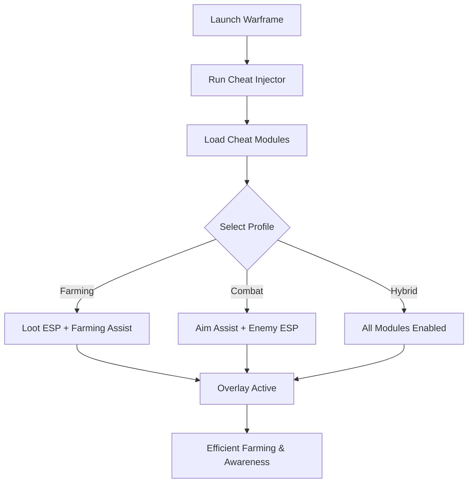

# Warframe Cheat Tool 🔮

**Warframe** is a fast-paced looter-shooter filled with endless grind, resource farming, and high-speed combat. For players who want smoother progression, the **Warframe Cheat Tool** provides **ESP overlays, loot awareness, and farming automation assists**, helping you stay efficient across missions, raids, and boss encounters.

---

## 🌐 Overview

The tool is designed as a **modular overlay and assist system**. ESP highlights enemies and loot, farming assists automate repetitive tasks, and combat modules stabilize aim and recoil. With hotkey switching and customizable profiles, it adapts to any mission type—whether you’re farming rare mods, clearing endless waves, or tackling bosses.

---

## 🔑 Features

* 👁 **ESP Overlay** – Enemies, allies, loot, and rare mod drops visible.
* 🎯 **Aim Assist** – Adjustable targeting for smoother combat flow.
* 💎 **Loot ESP** – Highlight rare mods, relics, and crafting materials.
* ⚡ **Farming Assist** – Automate repetitive grinding and loot pickup.
* 🔫 **Recoil Manager** – Stabilize rapid-fire weapons.
* 🗂 **Profile Manager** – Save configs for farming, stealth, or boss fights.
* ⌨️ **Hotkey Switching** – Toggle features instantly.
* 🔒 **Stealth Injection** – Lightweight, optimized for Windows 10/11.

---

## 🖥 Compatibility

| Platform       | Status        | Notes                  |
| -------------- | ------------- | ---------------------- |
| Windows 10     | ✅ Supported   | Stable builds          |
| Windows 11     | ✅ Optimized   | Smooth overlays        |
| Linux (Proton) | ⚠️ Partial    | ESP only               |
| macOS          | ❌ Unsupported | VM workaround required |

\[!NOTE]
The cheat works best with **DirectX rendering on Windows PCs**.

---

## ⚙️ Setup Guide

1. Download the Warframe Cheat Tool.

2. Extract into a secure folder.

3. Launch Warframe.

4. Run injector as administrator:

   ```bash
   warframe_cheat.exe -game warframe.exe -mode stealth
   ```

5. Configure `config.ini`:

   ```ini
   [ESP]
   Enemies=True
   Allies=True
   Loot=True
   RareMods=True
   EnemyColor=Red
   LootColor=Yellow
   RareModColor=Purple

   [AimAssist]
   FOV=90
   Smoothness=7
   Target=Chest
   ```

6. Toggle overlay with `Insert`.

\[!IMPORTANT]
Inject only **after the game fully loads** for maximum stability.

---

## 📊 Workflow Diagram



---

## 🎚 Example Configurations

**Farming Profile:**

```ini
Enemies=False
Loot=True
RareMods=True
```

**Combat Profile:**

```ini
Enemies=True
FOV=70
Smoothness=8
```

**Hybrid Profile:**

```ini
Enemies=True
Loot=True
RareMods=True
Allies=True
```

\[!WARNING]
Overusing all ESP layers can clutter visuals—stick to focused builds.

---

## ❓ FAQ

**Q: Does this cheat tool impact FPS?**
A: No, it’s lightweight with <3% system load.

**Q: Can I hot-swap configs mid-mission?**
A: Yes, profiles can be toggled instantly.

**Q: Does it track rare drops automatically?**
A: Yes, loot ESP highlights mods, relics, and rare items.

**Q: Will it sync with Warframe updates?**
A: Yes, builds are updated alongside patch cycles.

**Q: Is stealth injection fully safe?**
A: It reduces risks but no cheat is 100% undetectable.

---

## 🚀 Final Thoughts

The **Warframe Cheat Tool** unites **ESP overlays, farming assists, and combat stabilization** into one flexible package. Whether you’re farming rare relics, clearing missions, or hunting bosses, it maximizes efficiency and survival.
